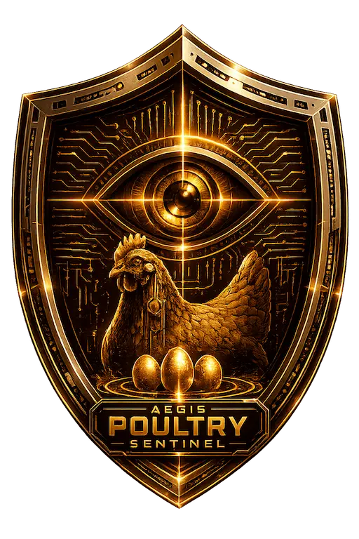

# PoultryVisionAI

<div align="center">
  
</div>

## Overview

PoultryVisionAI is a computer vision system for automatic monitoring and behavioral
analysis of poultry in commercial farming environments.

The system combines deep-learning object detection with multi-object tracking and
unsupervised anomaly detection to identify abnormal flock behavior — stress, panic
events, predator presence, environmental disturbances, or other unexpected situations.

It targets overhead surveillance cameras installed inside poultry houses and is built
for real-time processing with a Python inference backend and a reactive web dashboard.

---

## Objectives

* Detect chickens and hens under high-density farming conditions.
* Track individual birds across video sequences.
* Extract motion-based behavioral features per bird.
* Model normal flock behavior from historical footage.
* Detect abnormal events using statistical and machine-learning techniques.
* Provide an interactive web dashboard for monitoring and visualization.

---

## Architecture

```text
Video Stream
      │
      ▼
YOLOv11-S Object Detector  (fine-tuned, single class: chicken)
      │
      ▼
Bounding Boxes
      │
      ▼
Multi-Object Tracking  (ByteTrack / SORT)
      │
      ▼
Trajectory Generation
      │
      ▼
Kinematic Feature Extraction
      │
      ├──────────────► Mahalanobis Distance   (statistical)
      │
      └──────────────► Isolation Forest        (machine learning)
                           │
                           ▼
                 Anomaly Detection Engine
                           │
                           ▼
                 FastAPI REST / WebSocket API
                           │
                           ▼
                  React Web Dashboard
```

---

## Machine Learning Pipeline

### Object Detection

The detector is a **YOLOv11-S** model, fine-tuned for a single object class:

```
Class 0: Chicken
```

It was trained on datasets containing broiler chickens, laying hens, roosters, and
chicks across multiple colors, breeds, and viewpoints. A second domain-adaptation
stage fine-tunes the detector on the PIO dataset (overhead imagery from commercial
poultry facilities).

| Model            | Dataset                      | mAP    | Notes                         |
|------------------|------------------------------|--------|-------------------------------|
| `chicken_v1`     | Mixed chicken/hen imagery    | 0.925  | Baseline detector             |
| `PIO_chicken_v2` | PIO overhead (domain adapt.) | 0.865  | Crowded broiler barns         |

The trained weights are exported to ONNX (`./model/best.onnx`) and served through
ONNX Runtime.

### Multi-Object Tracking

Detections are associated across consecutive frames using a **ByteTrack / SORT**
tracker to produce persistent trajectories. Each tracked bird receives a stable
identifier that enables temporal behavior analysis.

### Kinematic Feature Extraction

For every tracked bird, the pipeline derives a motion feature vector:

* Position
* Velocity
* Speed
* Acceleration
* Direction changes
* Local neighborhood density
* Distance to nearby birds

These features form the input space for anomaly detection.

### Anomaly Detection — *pending training*

> **Status:** the detection model is trained; the two anomaly detectors below are still
> to be fitted on Colab from real chicken/hen farm footage. Training will emit a config
> JSON of fitted parameters (mean/covariance, thresholds, contamination) that is
> committed to the repository and loaded by the backend at inference time.

Two complementary detectors run in parallel over the same kinematic feature vector:

* **Isolation Forest** — a machine-learning detector that isolates outliers via random
  feature/split trees; the decision threshold is derived from a contamination percentile
  at fit time.
* **Mahalanobis Distance** — a statistical detector that fits a multivariate Gaussian to
  normal flock behavior and flags observations far from the learned mean/covariance.

Together they classify abnormal chicken and hen behavior on poultry farms.

---

## Backend

The backend is implemented in **Python**, optimized for real-time inference.

* Python
* FastAPI — REST + WebSocket API
* NumPy — numerical / feature computation and Mahalanobis statistics
* OpenCV — frame decoding and image processing
* ONNX Runtime — YOLOv11-S model inference
* scikit-learn — Isolation Forest
* PostgreSQL — persistence

Responsibilities: model inference, tracking, feature extraction, anomaly detection,
database interaction, and REST/WebSocket endpoints.

> **Note:** an earlier C++/Crow backend was removed in favor of the Python stack to
> keep training and serving in a single language.

---

## Frontend

The web dashboard is built with:

* TypeScript
* React
* Vite
* Tailwind CSS
* React Router
* Zustand — state management
* Axios — HTTP client
* Recharts — data visualization

The dashboard provides live monitoring, detection visualization, behavioral statistics,
historical anomaly reports, and farm analytics.

---

## Database

**PostgreSQL** persists application data: camera metadata, detection events, tracking
information, anomaly records, and system logs.

---

## Deployment

The project is containerized with Docker and orchestrated via Docker Compose, targeting
Linux servers with GPU acceleration.

---

## Technology Summary

| Layer      | Technologies                                                        |
|------------|---------------------------------------------------------------------|
| Detection  | YOLOv11-S (fine-tuned), ONNX Runtime                                 |
| Tracking   | ByteTrack / SORT                                                     |
| Anomaly    | Isolation Forest (scikit-learn), Mahalanobis Distance (NumPy)        |
| Backend    | Python, FastAPI, NumPy, OpenCV, ONNX Runtime                         |
| Frontend   | TypeScript, React, Vite, Tailwind CSS, Zustand, Axios, Recharts      |
| Database   | PostgreSQL                                                           |
| Infra      | Docker, Docker Compose                                               |

---

## Research Focus

PoultryVisionAI explores the integration of computer vision and unsupervised machine
learning for precision livestock farming. Rather than relying on object detection alone,
the project models flock dynamics and automatically identifies behavioral anomalies
through statistical and machine-learning methods.

---

## License

This project is intended for research, educational, and precision-agriculture
applications. Refer to the project license for usage and distribution terms.
